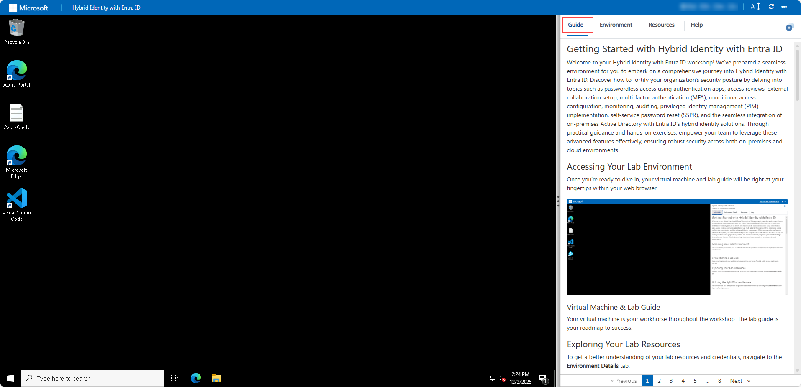
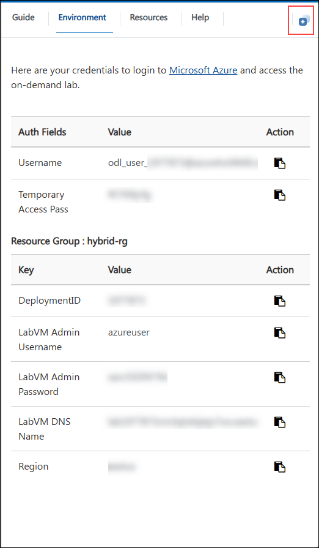
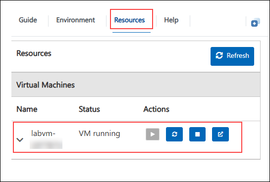

# Getting Started with Hybrid Identity with Entra ID

### Overall Estimated Duration: 4 Hours

## Overview

In this lab, you will explore the complete Hybrid Identity experience with Entra ID. You’ll work through hands-on exercises designed to strengthen your organization’s security posture by configuring passwordless authentication, access reviews, external collaboration, conditional access policies, monitoring, auditing, and Privileged Identity Management (PIM). You will also learn how to enable self-service password reset (SSPR) and seamlessly integrate on-premises Active Directory with Entra ID to implement a robust hybrid identity solution. Through guided steps and practical scenarios, this lab will equip you with the skills needed to secure and manage identities across both on-premises and cloud environments.

## Objective

## Accessing Your Lab Environment

Once you're ready to dive in, your virtual machine and lab guide will be right at your fingertips within your web browser.

### Virtual Machine & Lab Guide
 
Your virtual machine is your workhorse throughout the workshop. The lab guide is your roadmap to success.

## Exploring Your Lab Resources
 
To get a better understanding of your lab resources and credentials, navigate to the **Environment** tab.

## Utilizing the Split Window Feature
 
For convenience, you can open the lab guide in a separate window by selecting the **Split Window** button from the Top right corner.

 
## Managing Your Virtual Machine
 
Feel free to start, stop, or restart your virtual machine as needed from the **Resources** tab. Your experience is in your hands!

## Let's Get Started with Azure Portal

1. On your virtual machine, click on the Azure Portal icon and sign in to the **Azure Portal** (<http://portal.azure.com>).

1. On the **Sign in to Microsoft Azure** blade, you will see a login screen, in which enter the following email/username and then click on **Next**.  

   * **Azure Username/Email**:  <inject key="AzureAdUserEmail"></inject> 
   * **Temperory Access Pass**:  <inject key="AzureAdUserPassword"></inject>

        **Note**: Refer to the **Environment Details** tab for any other lab credentials/details.

    
  
    
  
1. If you see the pop-up **Stay Signed in?** click **Yes**.

    

1. If you see the pop-up **You have free Azure Advisor recommendations!** close the window to continue the lab. 

1. If a **Welcome to Microsoft Azure** popup window appears, click **Maybe Later** to skip the tour.

    

Now you're all set to explore the powerful world of technology. Feel free to reach out if you have any questions along the way. Enjoy your workshop!

