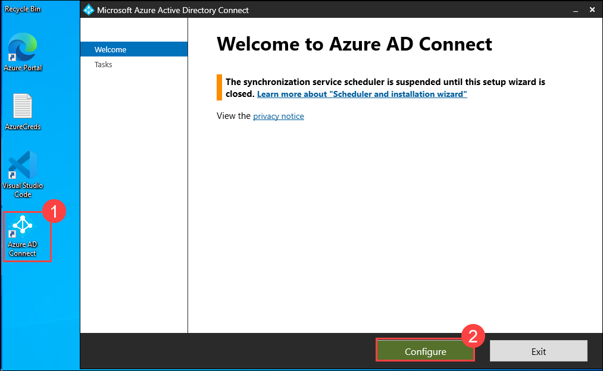
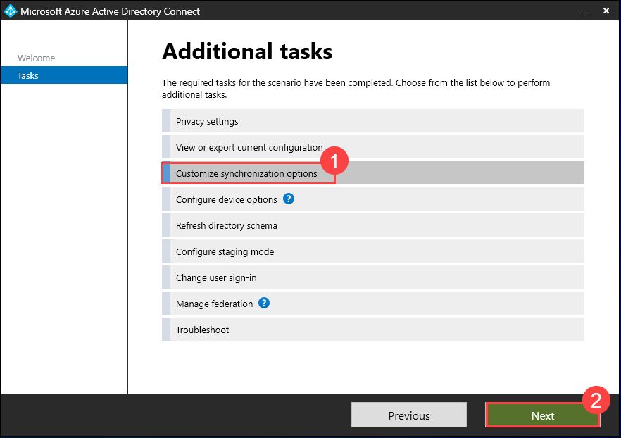
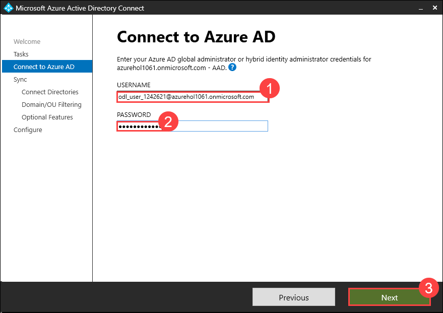
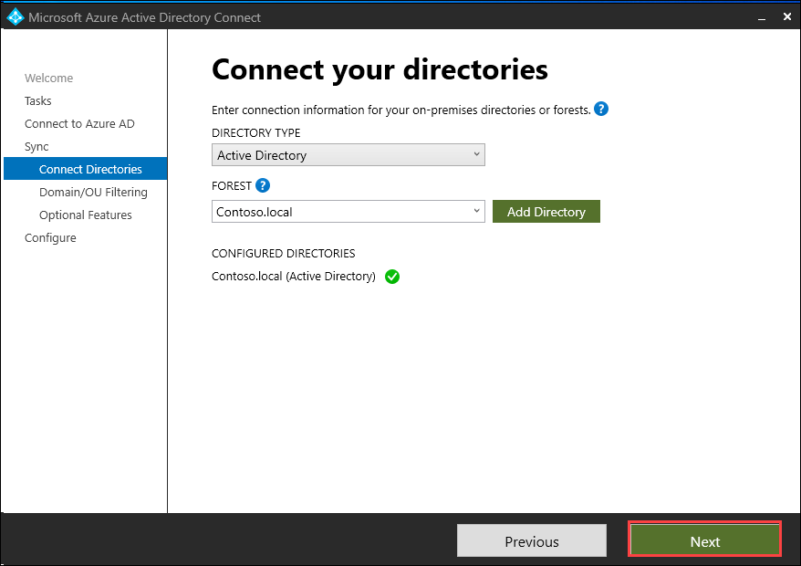
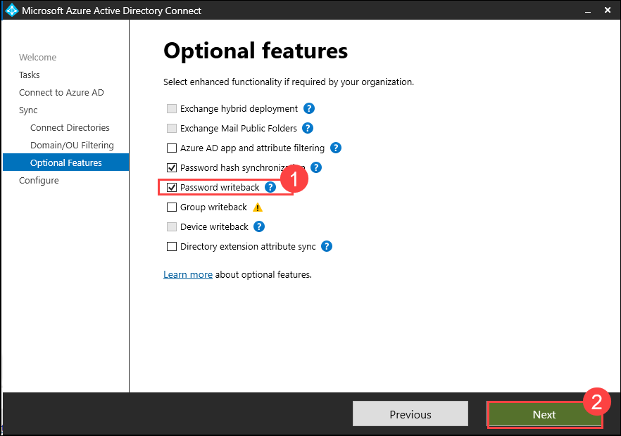
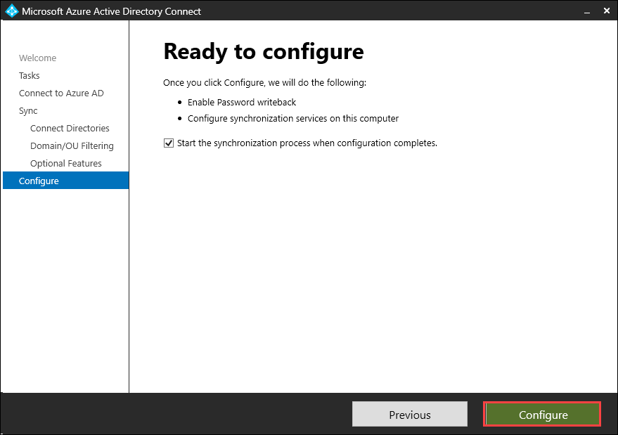
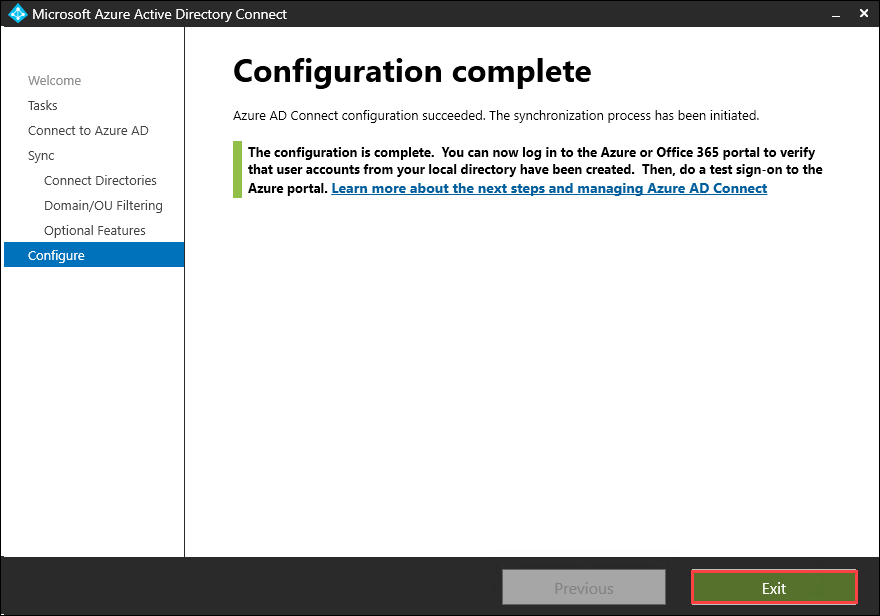
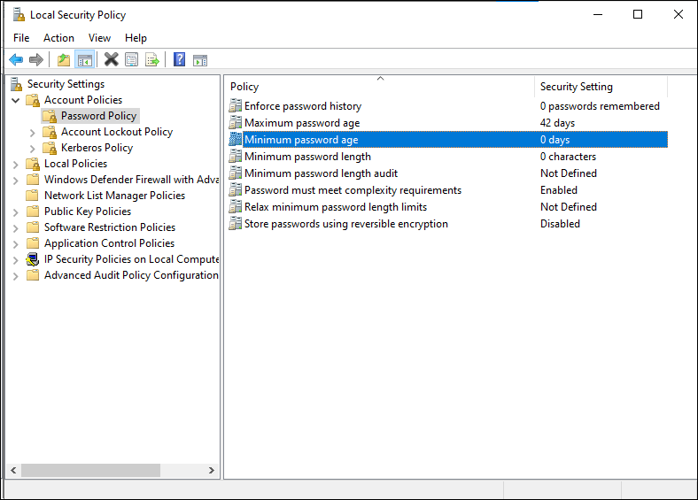

# Lab 2: Configuring Self-service password reset for user accounts in Azure AD

## Lab Overview 

This lab focuses on configuring Azure AD Connect with password writeback, updating the minimum password age policy to 0, enabling self-service password reset with authentication methods via Microsoft Entra Admin Center, and validating by changing a password via the My Account page in Microsoft Edge.

## Lab Scenario

In this lab scenario, you are tasked with setting up self-service password reset in Azure AD, employees can securely reset their passwords without IT intervention, improving productivity. Additionally, enabling password writeback ensures synchronization between on-premises and cloud environments, enhancing security and user experience.

## Lab objectives

In this lab, you will perform the following:

- Task 1: Configure password writeback and Password minimum age policy. 
- Task 2: Enable self-service password reset
- Task 3: Validate self-service password reset

### Task 1: Configure password writeback and Password minimum age policy. 

1. Select the **Azure AD Connect** application from the desktop

3. On the **Welcome to Azure AD Connect** page, select **Configure**.

   

4. On the **Additional tasks** page, select **Customize synchronization options**, and then select **Next**.

   

5. On the **Connect to Azure AD** page, if needed type **<inject key="AzureAdUserEmail"></inject>** in the **USERNAME** text box, type your Admin tenant password **<inject key="AzureAdUserPassword"></inject>** in the **PASSWORD** text box, and then select **Next**.

   

6. On the **Connect to your directories** page, select **Next**.

   

7. On the **Domain and OU filtering** page, select **Next**.

8. On the **Optional features** page, select **Password writeback**, and then select **Next**.

    

9. On the **Ready to configure** page, select **Configure**.

    

10. On the **Configuration complete** page, select **Exit**.

    

11. Open CMD and run the below command to update the minimum password age policy to 0.

      ```
        secedit /configure /cfg %windir%\inf\defltbase.inf /db defltbase.sdb /verbose
      ```

13. Once updated, restart the LabVM and verify if the policy is updated, navigate to Local security policy -> expand Security Settings -> Account Policies -> Password Policy. The Minimum Password Age should be set to 0.

    

### Task 2: Enable self-service password reset

1. On the taskbar select **Microsoft Edge**, in the address bar type **https://entra.microsoft.com/**, and then press **Enter**.

2. Sign in as  **<inject key="AzureAdUserEmail"></inject>**, and use the tenant Admin password **<inject key="AzureAdUserPassword"></inject>**, If the **Stay signed in?** prompt appears, select **No**.  

   > The Microsoft Entra admin center opens.

3. In the Microsoft Entra admin center, Navigate to the Search Resources section of the site.

4. In the search box, type **password reset**, and then select **Password reset**.

5. In the **Password reset | Properties** window, select **All** to enable self-service password reset to all users. Select **Save**.

6. On the **Password reset | Properties** blade, select **Authentication methods**.

7. For the methods available to users, ensure that **Mobile Phone** and **Email** are selected, and then select **Security Questions**.

8. For the **Number of questions required to register**, select **3**.

9. For the **Number of questions required to reset**, select **3**.

10. In the **Select security questions** section, select **No security questions configured**, then select **Predefined**. Select three questions of your choice, and then select **Ok**.

11. Select **Save**.

12. Select **Registration** Select **No** for **Require users to register when signing in**, and the select **Save**.

13. In the navigation pane, select **On-premises integration**.

14. Verify that your on-premises writeback client is running and Select the checkbox for **Write back passwords with Microsoft Entra Connect cloud sync** and then click **Save**.

15. Close Microsoft Edge.

### Task 3: Validate self-service password reset

1. On the taskbar, select **Microsoft Edge**.

2. Browse to **https://myaccount.microsoft.com**. 

3. On the **Pick an account** page, select **Use another account**.

4. On the **Sign in** page, enter **`msnider@xxxxxxx.onmicrosoft.com`** and then select **Next**.

  >**Note**: Replace xxxx with the tenantname provided.

5. On the **Enter password** page, enter **Pa55-w.rd!** or the password that you have entered and then select **Sign in**. If the Microsoft Edge prompts to save the password, select **Save**.

6. On the **My Account** page, in the navigation pane, select **Password**.

    

7. On the **Change password** page, enter the following information and then select **submit**:
     - Old password: **Pa55-w.rd!**
     - Create new password: **Pa55w.rd!1234**
     - Confirm new password: **Pa55w.rd!1234**

8. If Microsoft Edge prompts to save the password, select **Save**.

9. Close Microsoft Edge.

**Results**: After completing this exercise, you will have successfully configured and validated self-service password reset.

## Review

- Configure password writeback and establish a minimum password age policy.  
- Enable self-service password reset for user convenience and security.  
- Validate the self-service password reset process for functionality and effectiveness.

