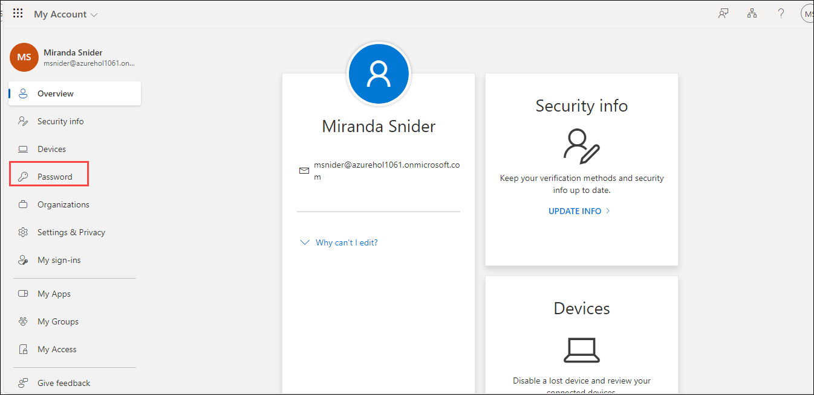

# Lab 2: Configuring Self-service password reset for user accounts in Entra ID

### Task 1: Enable self-service password reset

1. On the taskbar select **Microsoft Edge**, in the address bar type **https://entra.microsoft.com/**, and then press **Enter**.

2. Sign in as  **<inject key="AzureAdUserEmail"></inject>**, and use the tenant Admin password **<inject key="AzureAdUserPassword"></inject>**, If the **Stay signed in?** prompt appears, select **No**.  

   > The Microsoft Entra admin center opens.

3. In the Microsoft Entra admin center, Navigate to the Search Resources section of the site.

4. In the search box, type **password reset**, and then select **Password reset**.

5. In the **Password reset | Properties** window, select **All** to enable self-service password reset to all users. Select **Save**.

6. On the **Password reset | Properties** blade, select **Authentication methods**.

7. For the methods available to users, ensure that **Mobile Phone** and **Email** are selected, and then select **Security Questions**.

8. For the **Number of questions required to register**, select **3**.

9. For the **Number of questions required to reset**, select **3**.

10. In the **Select security questions** section, select **No security questions configured**, then select **Predefined**. Select three questions of your choice, and then select **Ok**.

11. Select **Save**.

12. Select **Registration** Select **No** for **Require users to register when signing in**, and the select **Save**.

13. In the navigation pane, select **On-premises integration**.

14. Verify that your on-premises writeback client is running and Select the checkbox for **Write back passwords with Microsoft Entra Connect cloud sync** and then click **Save**.

15. Close Microsoft Edge.

### Task 3: Validate self-service password reset

1. On the taskbar, select **Microsoft Edge**.

2. Browse to **https://myaccount.microsoft.com**. 

3. On the **Pick an account** page, select **Use another account**.

4. On the **Sign in** page, enter **`msnider@xxxxxxx.onmicrosoft.com`** and then select **Next**.

  >**Note**: Replace xxxx with the tenantname provided.

5. On the **Enter password** page, enter **<inject key="LabVM Admin Password"></inject>** or the password that you have entered and then select **Sign in**. If the Microsoft Edge prompts to save the password, select **Save**.

6. On the **My Account** page, in the navigation pane, select **Password**.

    

7. On the **Change password** page, enter the following information and then select **submit**:
     - Old password: **<inject key="LabVM Admin Password"></inject>**
     - Create new password: **Pa55w.rd!1234**
     - Confirm new password: **Pa55w.rd!1234**

8. If Microsoft Edge prompts to save the password, select **Save**.

9. Close Microsoft Edge.

**Results**: After completing this exercise, you will have successfully configured and validated self-service password reset.

