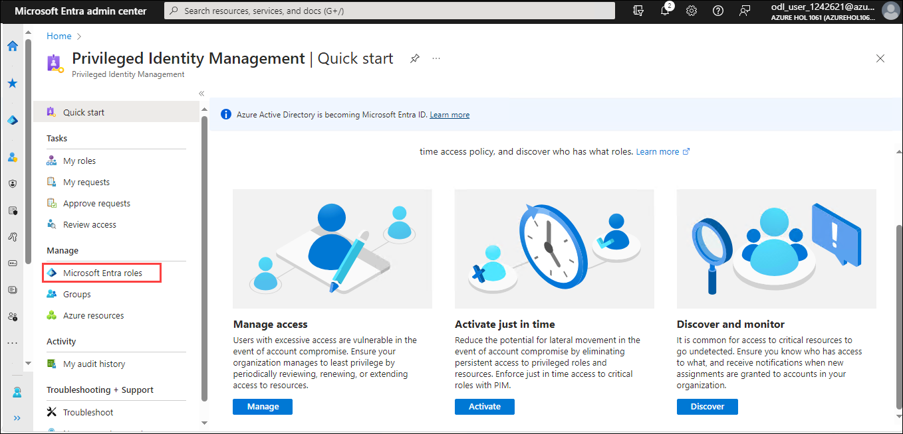
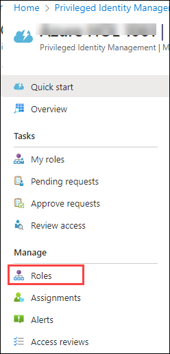
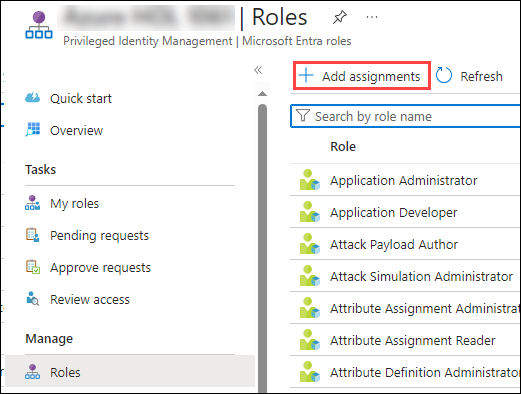
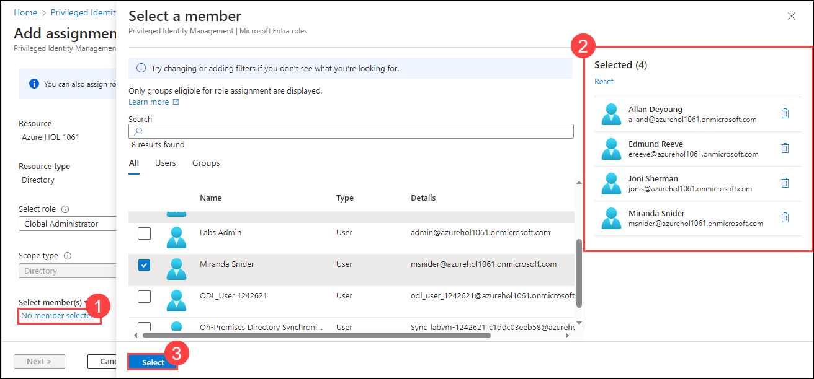
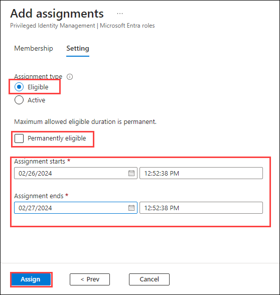
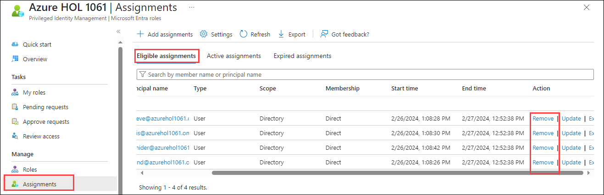

# Lab 3: Implement and use Privileged Identity Management

## Task 1 - Assign Azure resource roles

1. Sign in to [https://entra.microsoft.com](https://entra.microsoft.com) using a Global Administrator account.

2. Search for and then select **Privileged Identity Management.**

3. In the Privileged Identity Management page, in the left navigation, select **Micrososft Entra roles.**

   

4. In the left navigation menu, under **Manage**, select **Roles** to see the list of Entra roles.

   

5. On the top menu, select + **Add assignments**.

   

6. In the Add assignments page, select the **Select role** menu and then select **Gloabl Administrator.**

7. Under **Select member(s),** select **No member selected**.

   

8. In the Select members pane, select the following users and then chose **Select**.
    | Name           | 
      | -------------- | 
      | Edmund Reeve   | 
      | Miranda Snider | 
      | Allan Deyoung  | 
      | Joni Sherman   | 
    
9. Select **Next**.

10. On the **Settings** tab, under **Assignment type**, select **Eligible**.

   - **Eligible** assignments require the member of the role to perform an action to use the role. Actions might include performing a multi-factor authentication (MFA) check, providing a business justification, or requesting approval from designated approvers.

   - **Active** assignments do not require the member to perform any action to use the role. Members assigned as active have the privileges always assigned to the role.

11. Specify an assignment duration by changing the start and end dates and times. (Uncheck the permanently eligible)

12. When finished, select **Assign**.

   

13. After the new role assignment is created, a status notification is displayed.

## Task 2 - Update or remove an existing Entra role assignment

Follow these steps to update or remove an existing role assignment.

1. Open **Microsoft Entra Privileged Identity Management**.

2. Select **Micrososft Entra roles.**

3. Under **Manage**, select **Assignments**.

4. On the **Eligible assignments** tab, in the Action column, review the available options.

6. Select **Remove**.

   

7. In the **Remove** dialog box, review the information and then select **Yes**.

   
