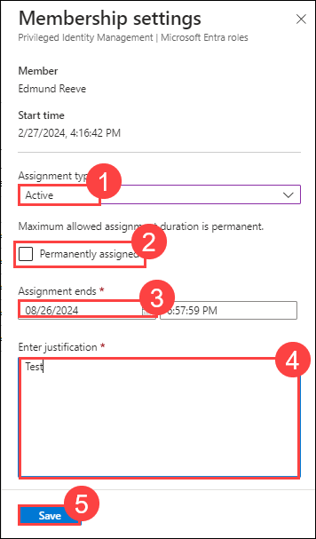

# Lab 3: Implement and use Privileged Identity Management

## Lab Overview

This lab focuses on setting up the use of Microsoft Entra to assign Global Administrator roles to specified users with defined privileges and durations. Then, manage and update existing role assignments, transitioning them from eligible to active status as needed, with specified durations and justifications.

## Lab Scenario
In this lab scenario, you are tasked with the need to delegate specific Azure resource access to different departments while ensuring security. By implementing Privileged Identity Management, they can assign temporary Global Administrator roles to designated employees, requiring approval and justification, thus enhancing security and governance.

## Lab objectives
In this lab, you will perform the following:

- Task 1: Assign Azure resource roles
- Task 2: Update or remove an existing Entra role assignment

## Task 1 - Assign Azure resource roles

1. Sign in to [https://entra.microsoft.com](https://entra.microsoft.com) using ODL_User credentials.

   - Username : **<inject key="AzureAdUserEmail"></inject>**
   - Password : **<inject key="AzureAdUserPassword"></inject>**

2. Search for and then select **Microsoft Entra Privileged Identity Management.**

3. In the Privileged Identity Management page, in the left navigation, select **Micrososft Entra roles.**

    

4. In the left navigation menu, under **Manage**, select **Roles** to see the list of Entra roles.

    

5. On the top menu, select + **Add assignments**.

    

6. In the Add assignments page, select the **Select role** menu and then select **Gloabl Administrator.**

7. Under **Select member(s),** select **No member selected**.

8. In the Select members pane, select the following users and then chose **Select**.
    | Name           | 
      | -------------- | 
      | Edmund Reeve   | 
      | Miranda Snider | 
      | Allan Deyoung  | 
      | Joni Sherman   | 

        

9. Select **Next**.

10. On the **Settings** tab, under **Assignment type**, select **Eligible**.

   - **Eligible** assignments require the member of the role to perform an action to use the role. Actions might include performing a multi-factor authentication (MFA) check, providing a business justification, or requesting approval from designated approvers.

   - **Active** assignments do not require the member to perform any action to use the role. Members assigned as active have the privileges always assigned to the role.

11. Specify an assignment duration by changing the start and end dates and times. (Uncheck the permanently eligible)

12. When finished, select **Assign**.

    

13. After the new role assignment is created, a status notification is displayed.

## Task 2 - Update or remove an existing Entra role assignment

Follow these steps to update or remove an existing role assignment.

1. Open **Microsoft Entra Privileged Identity Management**.

2. Select **Micrososft Entra roles.**

3. Under **Manage**, select **Assignments**.

4. On the **Eligible assignments** tab, in the Action column, review the available options.

6. Select **Remove** to remove the user from eligible assignments.

    

7. In the **Remove** dialog box, review the information and then select **Yes**.

    

8. In order to make the eligible assignment to active for any user, select **Update** from Action list.

9. Provide the below details in **Membership settings** and click on **Save**

     - Assignment type : Active
     - Permanently eligible : Uncheck the box
     - Assignment ends : Enter the next date
     - Enter Justification : Test
  
       

## Review

 In this lab, you have completed:

- Assigned appropriate Azure resource roles to users or groups.  
- Updated or removed an existing Entra role assignment as needed.

## You have successfully completed the lab. Click on Next >> to procced with next exercise.
