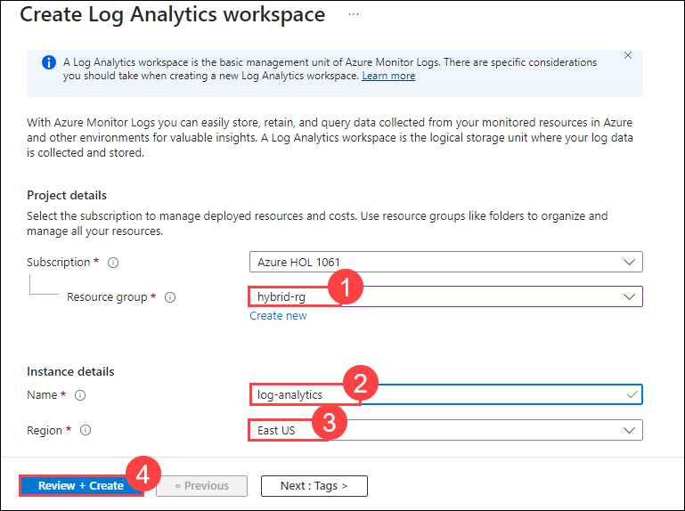
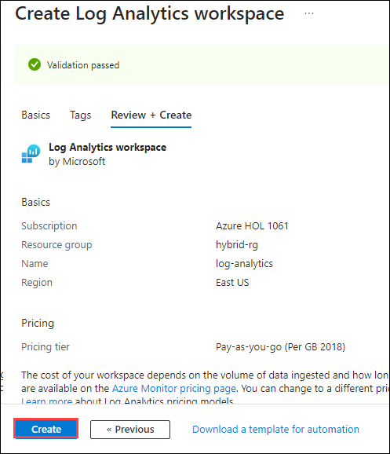
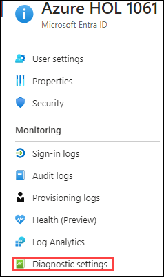
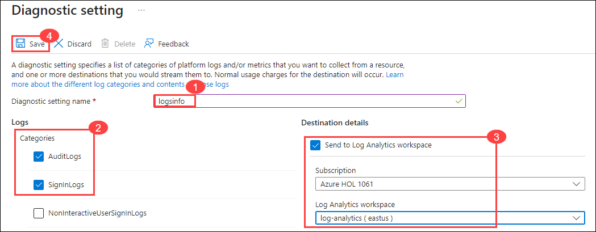
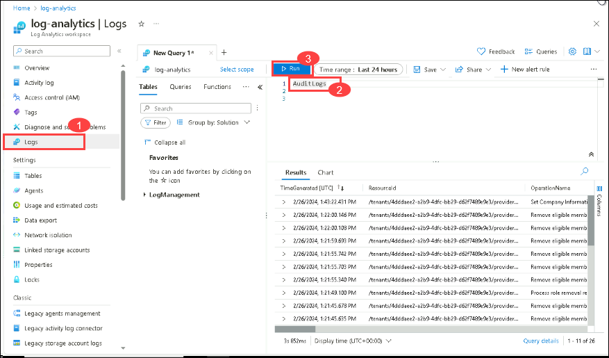
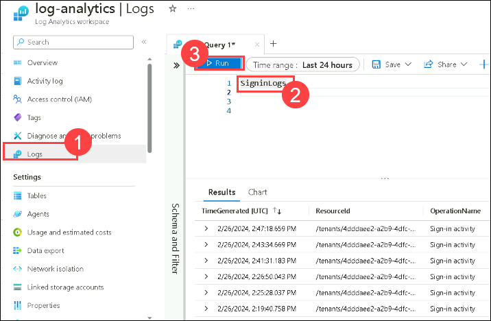

# Lab 4: Monitor and audit Entra ID for security and compliance purposes

## Lab Overview 
This lab focuses on setting up a  Log Analytics workspace in Azure to store and analyze logs from Azure Arc-enabled machines. Configure diagnostic settings in Microsoft Entra ID to collect audit and sign-in logs, directing them to the created workspace.

## Lab Scenario
In this lab scenario, you are tasked with creating Log Analytics with Entra ID. Administrators can centrally collect and analyze audit and sign-in logs from various sources, ensuring adherence to security policies and facilitating timely incident response. 

## Lab objectives
In this lab, you will perform the following:

- Task 1: Create Log Analytics Workspace
- Task 2: Add Diagnostic setting to collect audit logs
- Task 3: Verify the logs in the workspace

## Task 1 - Create Log Analytics Workspace

In this task, you will create a Log Analytics workspace for to store the log information and analysing the machines onboarded through Azure Arc.

1. Sign in to https://portal.azure.com using below credentials.

    - Username : **<inject key="AzureAdUserEmail"></inject>**
    - Password : **<inject key="AzureAdUserPassword"></inject>**

1. In the Search bar of the Azure portal, type **Log Analytics**, then select **Log Analytics workspaces**.

1. Select **+ Create** from the command bar.
    
1. On the Create Log Analytics workspace page, add the below settings and click on **Review + Create (4)**.

      | Setting | Value|
      |----------|--------|
      | Resource Group | **hybrid-rg** (1)|
      | Name | **log-analytics<inject key="DeploymentID" enableCopy="false"/>**|
      | Region | **East US** (3)|

   

1. Once the workspace validation has passed, select **Create**. Wait for the new workspace to be provisioned, this may take a few minutes.

   

## Task 2 - Add Diagnostic setting to collect audit logs

1. Navigate to Microsoft Entra ID, and select **Diagnostic settings** under Monitoring section.

   

1. Click on **+Add diagnostic setting** and provide the below settings

   | Setting | Value |
   -----------|---------
   | Diagnostic setting name | **Logsinfo** |
   |Logs | select **Auditlogs** and **signinlogs** |

   

1. On **Destination details**, select the **Send to Log analytics checkbox** and make sure that log analytics workspace which is created earlier is selected.

1. Click on **Save**.

  >**Note**: Wait for about 15 mins for logs ingestion to happen and proceed with the next task.

## Task 3 - Verify the logs in the workspace

1. Navigate to the **Log analytics workspace** and Select **Logs** from the general section of the pane.

1. Close all the pop-ups until the query pane is visible.

1. In the query pane, run the below queries, to view the activity data ingested into the workspace.

      ```
       AuditLogs
      ```
    

      ```
       SigninLogs
      ```
    
