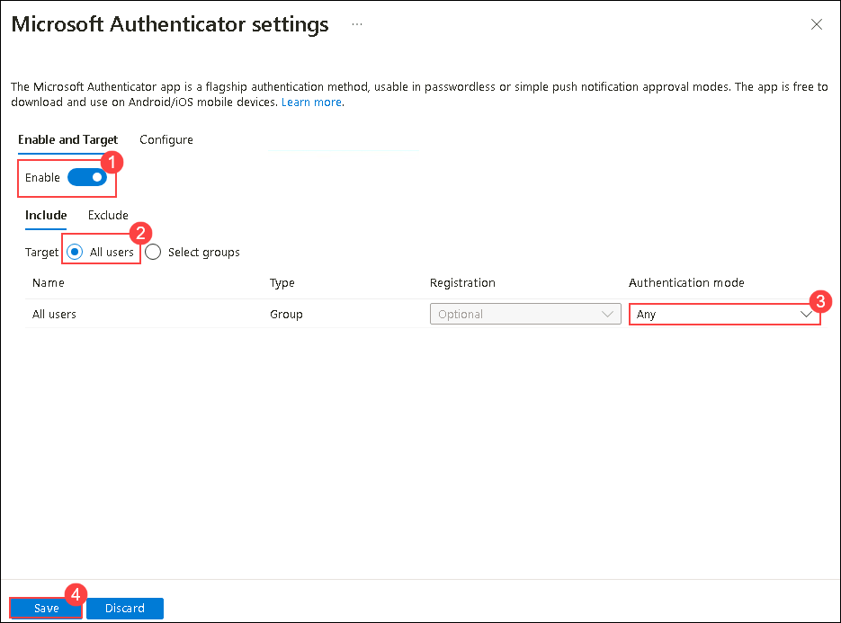

## Lab07 - Configuring passwordless sign-in using an authentication app (Read -Only)

  >**Note**: During this Azure lab, you'll set up passwordless sign-in, which may involve registering personal mobile devices with Azure AD. We recommend following instructions provided and avoiding device registration unless necessary for learning objectives. Understand access implications within Azure.

**Pre-requisities** - Install the Microsoft Authenticator app in mobile

### Task 1: Enable passwordless phone sign-in authentication methods

1. Sign in to https://entra.microsoft.com/.

1. On the **Pick an account** page, select **<inject key="AzureAdUserEmail"></inject>**.

1. On the **Enter password** page, enter the password **<inject key="AzureAdUserPassword"></inject>**.

1. From the left navigation pane, browse to Protection > Authentication methods > Policies.

1. Select **Microsoft Authenticator**

1. Under **Microsoft Authenticator settings**, choose the following options within the Enable and Target tab.

      - Enable - yes (1)
      - Target - All users (2)
      - Authentication mode - select **Any** (3)

1. Click on **Save** (4) to enable passwordless sign for All users.

   

### Task 2: Configure signin methods to the user
 
1. Navigate to https://portal.office.com using the credentials provided in the environment details page.

1. Select the profile icon located at the top right corner and select **View account**.

1. Select the **Security info** > **+Add signin method**

   >**Note:** If you are prompted to sign in using the SMS code click on **Text** and enter the code and sign in.

1. Under **Add a Method**, choose **Authenticator app** and click **Add**.

1. Select **Next** twice until the QR code page is visible.

1. Open Microsoft Authenticator which was installed in your mobile, click on **Add account** > **Work or school account**.

1. On **Add work or school account**, select **Scan a QR code** to scan the QR code from the browser to add the account.

1. Once the account is added, on the browser page showing QR Code, click **Next** to approve this request using Authenticator app and to add this method in signin page.

### Task 3: Enable Phone signin

1. Open **Authenticator app** and select the account added and click on **set up phone signin** and click **Continue**.

1. Enter the password provided in the environment details page and approve the sign-in requests.

1. Select **Register** to register the device.

1. Click on **Finish** after the setup completion.

   >**Note**: Please wait for about 5 mins and proceed with next task.

### Task 4: Validate the passwordless signin

1. Open the incognito tab, and navigate to https://portal.azure.com/

1. On the **Sign in** page, enter the email address of the same user who had registered with phone signin.

1. On the **Enter Password** page, select the **Use an app instead** and it will provide a two digit number and ask to enter in authenticator app pop-up in the mobile to approve the sign in request.

1. Once it is approved in the app, it will redirect to the home page of the azure portal without prompting for password.

## You have successfully completed the lab.

   
